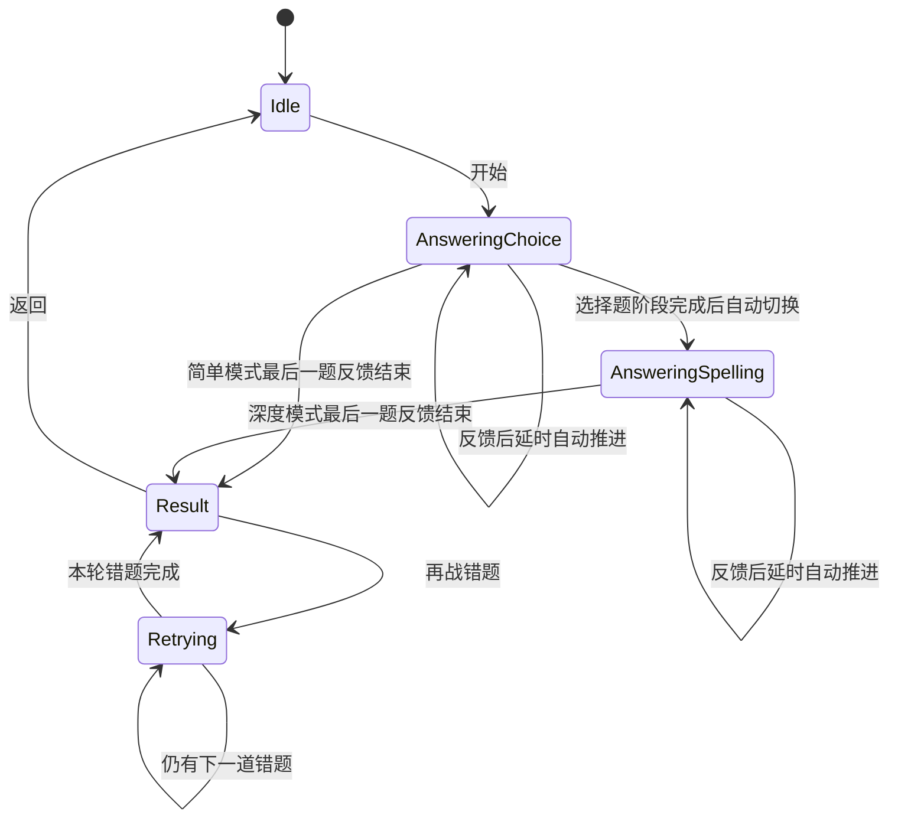

# 单词刷实现设计

- 状态：首版已实现，已接入统一语言工作区（2026-08-19）
- 日期：2026-08-17
- 草图依据：词义选择题、单词拼写题、结算画面，以及简单/深度模式流程图

## 1. 目标与阶段边界

单词刷用于从当前语言空间已经导入的词库中抽取词条，通过词义选择和单词拼写检验记忆结果。它是语言空间内的学习功能，答题期间继续累计当前语言的学习时长。

本阶段包含：

- 默认范围和指定文档日期两种抽题范围。
- 简单、深度两种难度。
- 词义四选一和根据词义拼写单词两种题型。
- 本轮结算、错题再战和返回空闲答题区。
- `820 × 560` 最小窗口、深浅主题、键盘操作和基础辅助功能适配。

本阶段不包含：

- 答题历史、正确率趋势、错词本或成就统计。
- 自定义题量、计时答题、提示次数或跳题。
- 自动生成新词义、近义词、例句、发音或 AI 解释。
- 跨语言混合抽题、云端同步或跨设备恢复。
- 应用退出后的未完成答题恢复。

## 2. 入口、路由与计时

单词刷现在只通过统一工作区顶部功能栏进入，页面不再为顶部栏预留空间。语言入口从首页直接恢复该语言上次使用的功能；首次进入时默认打开单词本。进入页面时固定语言归属，页面内不提供语言切换器。统一工作区路由为 `.workspace(LanguageSpace, .wordQuiz)`：

- 从日语空间进入，只读取日语词库并累计日语时长。
- 从英语空间进入，只读取英语词库并累计英语时长。
- 统一工作区内切换到同一语言的其他功能时继续计时，不产生暂停和重新补算。
- 离开到总览或设置页时，由现有计时控制器正常暂停。

## 3. 页面结构与自适应布局

页面保留与现有功能一致的返回入口和标题。统一工作区中的标题和返回箭头沿用页面原始位置；标题下方的主要内容在整个功能页面区域内横向、纵向整体居中，不依赖固定窗口坐标。顶部悬浮栏作为覆盖层出现时允许遮挡页面内容，但不得改变答题区、设置区或分隔线的位置。

主要内容分为左宽右窄两列：

- **答题区**：占据主要宽度，初始状态显示低对比度双行水印；答题、反馈和结算内容均在区域内双向居中。
- **分隔线**：使用低对比度竖线，与设置区共享同一固定主体高度；线条上端、下端分别与设置区边界平齐，同时与窗口上下边缘保留留白。
- **设置区**：保持稳定窄列，包含范围、日期、难度和开始按钮；整组控件在主体内纵向居中并紧凑排列。

设置使用符合语义的原生控件：

- 范围和难度使用分段选择器。
- 日期使用菜单选择器，只有选择“指定日期”时出现。
- 英语空间的开始按钮显示 `Let's go`，日语空间显示 `始めます`；按钮位于设置列底部并保持相同尺寸。
- 英语空闲水印分两行显示 `I know`、`you‘re ready`；日语空闲水印分两行显示 `準備が`、`できましたか`。

自适应规则：

- 默认宽度下，四个词义选项以固定短宽度横向排列，并在答题区居中，不向窗口左侧延展。
- 可用宽度不足时，选项自动改为固定短宽度的 `2 × 2`，按钮保持等宽、稳定高度，长词义允许换行。
- 拼写题在宽窗口下为“输入线 + 词义”的横向结构；紧凑窗口下可缩短输入区域并允许词义换行，但两者仍保持视觉居中。
- 设置列不得因题目、反馈或结算内容变化而移动，主体整体限制最大宽度并向窗口中央收拢。
- 单词、选项、拼写输入和反馈均占用稳定布局槽；反馈出现前后不得改变答题控件的位置。
- 页面不使用包裹整个主体的大卡片；草图外框只表示内容边界，正式页面沿用当前沉浸式背景和细网格。

答题区顶部使用克制的 `当前题 / 本轮总题数` 进度，不加入任务压力、倒计时或评价文案。

## 4. 数据来源与范围语义

现有 `WordEntry`、`WordOccurrence` 和 `WordBookEntrySnapshot` 已足够支持首版，不新增 SwiftData 表，也不迁移现有数据。

### 4.1 已导入词条

“已导入”由 `occurrenceDates` 是否为空判断：

- `occurrenceDates` 非空：进入单词刷候选。
- `occurrenceDates` 为空：属于纯手动新增的未归档词条，不进入候选。

不能只依赖 `isManuallyCreated`。一个词可能先手动创建，后来又通过 Markdown 导入；此时主词条仍可能保留手动标记，但已经拥有有效文档日期，应当进入测试。

同一语言空间中的重复词只有一个主词条，因此高频词在一次抽样中也只出现一次。题目使用点击开始按钮时读取到的当前主词条和当前词义；单词本之后的编辑只影响下一次测试。

### 4.2 默认范围

默认范围读取当前语言空间全部已导入主词条，按稳定词条 ID 去重后无放回随机抽取：

```text
x = min(20, 当前语言空间已导入主词条数)
```

不足 20 个时全部选入，再随机排列；达到或超过 20 个时均匀随机选择 20 个。

### 4.3 指定日期

界面中的“日期”表示 Markdown 顶部的文档日期，不是用户实际点击导入的时间，也不是学习记录日期。

- 日期菜单展示当前语言空间所有出现日期，去重后按日期递减。
- 切换到指定日期时默认选择最近日期。
- 同一天多次成功导入时，候选是这些批次的词条并集。
- 指定日期内同一主词条只出现一次。
- 从该日候选中随机抽取最多 20 个，不足 20 个时全部选入。

目标词必须来自用户选择的范围。选择题的干扰词义可以扩展到当前语言空间全部已导入词条，以避免某一天词数较少时无法组成四个选项。

## 5. 随机抽题与会话快照

随机逻辑只在领域生成器中执行，禁止在 SwiftUI `body` 或视图刷新时调用 `shuffle()`。

点击开始按钮后一次性冻结：

- 语言空间、范围、日期和难度。
- 抽中的主词条及其文本、词义。
- 两种题型的题目顺序。
- 每道选择题的四个选项及选项顺序。
- 拼写题可接受答案集合。

正式环境使用系统随机源；单元测试注入固定随机源，保证抽样、题序和选项可以重复验证。

## 6. 难度与题目队列

设本次抽中 `x` 个词。

### 6.1 简单模式

- 只生成词义选择题。
- 每个词生成一道题，共 `x` 道。
- 每道题展示单词和四个互不重复的词义。

### 6.2 深度模式

- 每个词生成一道词义选择题和一道单词拼写题，共 `2x` 道。
- 首轮必须先完成全部 `x` 道选择题，再进入全部 `x` 道拼写题。
- 两个阶段使用同一批词，但可以独立随机排列，避免第二阶段只凭上一阶段顺序作答。
- 同一词的两种题型拥有不同题目 ID，正误分别记录。

## 7. 词义选择题

题面上方显示目标单词，下方显示四个词义选项。

组题规则：

1. 正确词义只出现一次。
2. 三个错误词义来自其他主词条，不能来自目标词本身。
3. 词义先去除首尾空白、折叠连续空白并做 Unicode 规范组合，再用于去重。
4. 与正确词义规范化后相同的词义不能作为干扰项。
5. 优先从本轮其他目标词抽取；不足时扩展到当前语言空间全部已导入词条。
6. 四个选项生成后再独立洗牌，正确项位置不能固定。

用户点击选项即提交本题。提交后：

- 锁定四个选项，禁止重复修改答案。
- 明确标出所选答案和正确答案。
- 答错时保留正确词义供用户确认。
- 不显示手动“下一题”按钮；答对停留 `1.5` 秒后自动推进，答错停留 `3` 秒后自动推进。

### 7.1 正确选项环形进度

用户直接点中正确选项后，在该按钮边界叠加绿色细进度线：

- 进度线从圆角矩形左上方的顶部切点开始，顺时针沿完整边界绘制，并以同一点作为终点。
- 使用线性 `0.4` 秒动画；完成后保留完整边框，直到现有 `1.5` 秒正确反馈结束。
- 动画只属于视图瞬时状态，不写入 `WordQuizStore`、数据库或答题结果模型。
- 叠加层不得参与布局计算，不能改变按钮尺寸、选项间距或答题区域位置。
- 用户答错时不启动进度动画。此时继续使用原有红色错误选项和绿色正确答案揭示效果。
- 系统开启“减少动态效果”时直接显示完整绿色边框，不执行路径运动。

答对后的基础绿色背景和文字反馈继续保留。动画进行期间不能在进度线下方预先绘制完整强绿色边框，否则会掩盖进度变化。

### 7.2 词义选项点击音效

每次词义选项按钮接受一次有效点击时，立即播放当前设置的点击音效，不区分答案正误。反馈仅覆盖四选一按钮，不扩展到拼写题确认按钮。

- 设置提供“关闭、音效 1、音效 2”三种全局选择，英语与日语空间共用，默认关闭。
- 偏好使用 `UserDefaults` 保存，不进入 SwiftData。
- 两份音频复制进应用资源包，运行时不依赖用户下载目录。
- 播放服务启动时分别准备两种资源并保持播放器实例，降低首次点击和切换后的延迟。
- 音效播放与判题、自动推进解耦。资源缺失、解码失败或播放失败时静默降级，不能阻止提交答案。
- 设置页提供独立试听按钮；试听不改变答题状态。

## 8. 单词拼写题

题面显示中文词义和一个单行文本输入框。输入框默认获得键盘焦点，支持点击“确认”或按 Return 提交；空输入不能提交。

拼写判定复用现有单词规范化方向：

- **英语**：去除首尾空白、折叠连续空白、做 Unicode 规范组合并忽略大小写；连字符、撇号和其他标点不能忽略。
- **日语**：去除首尾空白、折叠连续空白并做 Unicode 规范组合后精确比较；不自动把平假名、片假名、汉字读音或全半角写法视为相同答案。

提交后锁定输入框并显示正误；答错时展示目标单词。答对停留 `1.5` 秒、答错停留 `3` 秒后自动推进，反馈期间 Return 不得提前切题。

同一个中文词义可能对应多个不同单词，只显示词义时无法唯一指向目标词。当前语言空间已导入词条中“规范化词义相同”的所有单词都作为可接受答案，避免用户输入另一个合理词却被判错。

## 9. 状态机与交互锁定

单词刷由单一页面级状态拥有者管理，不把分散的布尔值直接堆在视图中。



运行约束：

- 空闲态可修改范围、日期和难度，左侧答题区为空。
- 答题、反馈、错题再战和结算期间，范围、日期、难度及开始按钮全部锁定。
- 结算页的“返回”只结束本次会话、清空左侧内容并回到空闲态；保留右侧最近配置。
- 页面顶部的返回入口用于回到首页。至少提交过一道题后，通过页面返回或顶部功能栏离开都需要确认；确认后丢弃内存会话。
- 关闭应用时直接丢弃未完成会话，不在下次启动时恢复。

## 10. 结算与错题再战

完成当前题目队列后，答题区切换为结算内容：

```text
回答正确：正确题数 / 本轮总题数
```

- 本轮全对：只显示“返回”。
- 本轮存在错题：显示“再战错题”和“返回”。

错题再战以“具体题目”为单位，不以主词条为单位：

- 同一词的选择题错、拼写题对，只重做选择题。
- 两种题型都错，则两题都进入错题队列。
- 每次再战只保留上一轮仍然答错的题目；已经答对的题目从后续轮次移除。
- 再战题序重新随机，不要求继续保持“先选择、后拼写”的首轮顺序。
- 选项和可接受答案仍使用会话开始时的冻结快照，不重新读取数据库。
- 错题全部答对后，结算页只保留“返回”。

结算分数统计当前轮第一次提交的结果，不因同一题在当前轮重复点击而变化。

## 11. 空状态与失败处理

每次开始前重新校验候选数据：

- 没有已导入词条：禁用开始按钮，提示先向当前语言空间导入单词。
- 没有任何文档日期：禁用“指定日期”。
- 所选日期因删除词条而变为空：不开始测试，刷新日期列表并提示重新选择。
- 当前语言空间不足四个不同词义：禁用开始按钮，不生成重复选项或伪造词义。
- 仓储读取失败：显示独立错误反馈，不能伪装成空词库，也不能启动空会话。
- 题目生成过程若违反四选一不变量：整体失败并返回空闲态，不留下半套题目。

## 12. 运行时模型与持久化边界

建议新增独立的纯领域类型：

- `WordQuizScope`：默认范围或指定文档日期。
- `WordQuizDifficulty`：简单或深度。
- `WordQuizCandidate`：稳定词条 ID、单词和词义快照。
- `WordQuizQuestionKind`：词义选择或单词拼写。
- `WordQuizQuestion`：稳定题目 ID、题面、选项或可接受答案。
- `WordQuizRound`：当前队列、答案、题号、得分和错题。
- `WordQuizSessionState`：空闲、答题、反馈、结算。

以下状态只保存在当前页面内存中：

- 本次配置、抽样结果和随机顺序。
- 当前输入、已选答案和反馈状态。
- 本轮分数、错题队列和再战轮次。

不新增 `QuizRecord`、`WrongWord`、正确率或累计答题数等 SwiftData 模型，也不因答题修改主词条、出现日期、高频状态或学习时长记录。学习时长仍只由现有计时控制器按页面活动状态累计。

## 13. 模块边界

建议按现有工程风格拆分：

```text
Domain/
  WordQuizModels.swift
  WordQuizEngine.swift
Data/
  WordQuizCandidateSource.swift
Stores/
  WordQuizStore.swift
Features/WordQuiz/
  WordQuizView.swift
  WordQuizComponents.swift
```

职责约束：

- 候选源包装现有 `WordBookRepository`，负责语言隔离、过滤已导入词条和生成倒序日期列表。
- 组题、判题、计分和错题收敛由纯领域引擎完成，不依赖 SwiftUI 或 SwiftData。
- `WordQuizStore` 是页面状态的唯一写入者，负责加载、启动、提交、推进、结算和退出确认。
- 视图只渲染状态并转发用户意图，不直接查询 SwiftData，不自行洗牌或判分。
- 开始时复制词条快照；会话进行中不受词库编辑或删除影响。

首版候选源可复用现有 `entries(in:)` 和 `entries(on:in:)`，无需修改数据库 Schema。若未来数据量显著扩大，再单独评估专用只读查询，不在本阶段提前优化。

## 14. 键盘与辅助功能

- 选择题支持数字键 `1`～`4` 选择对应选项。
- 拼写题按 Return 提交；反馈出现后由统一计时自动推进，Return 不绕过停留时间。
- 每个选项提供完整词义标签、序号、选中状态和判定结果。
- 拼写输入框提供当前语言和题型标签，错误反馈不能只依靠颜色。
- 进度、题型切换和结算结果通过稳定辅助功能值表达。
- 页面顶部返回、结算返回和再战错题使用不同标识，避免自动化测试和 VoiceOver 混淆。
- 系统开启“减少动态效果”时，题目与结算只做直接内容切换，不使用位移过渡。

## 15. 测试设计

### 15.1 领域单元测试

- 候选数为 `0、1、19、20、21` 时抽样数量正确且无重复。
- 默认范围排除纯手动词条，但包含后来获得导入日期的手动主词条。
- 日期菜单去重倒序，同日多批次取并集，同一词只出现一次。
- 简单模式生成 `x` 道选择题；深度模式生成 `2x` 道且首轮题型顺序正确。
- 每道选择题恰好四个不同词义，正确答案恰好出现一次且位置可随机。
- 干扰项不足时不会生成非法题目。
- 英语和日语拼写按各自规范化规则判定。
- 相同词义的多个可接受拼写不会被误判。
- 同一词两种题型分别计错；再战后错题集合只减不增。
- 固定随机源下，抽样、题序和选项顺序完全可复现。

### 15.2 集成与 UI 测试

- 日语、英语入口读取各自词库，路由切换不串数据。
- 单词刷页面及其子状态持续计入对应语言学习时长。
- 默认范围、指定日期、简单和深度模式可以完整走到结算。
- 答题期间设置被锁定，返回空闲态后恢复可编辑。
- 全对时只有返回；有错时出现再战错题，循环到全对后按钮收敛。
- `820 × 560` 下主体双向居中、设置列稳定、分隔线有限长，四个选项采用 `2 × 2` 且不重叠。
- 默认窗口下四个选项可横向排列，长单词和长词义不会撑破控件。
- 作答前后单词、四个选项和拼写区域的 frame 保持不变。
- 正确反馈停留 `1.5` 秒，错误反馈停留 `3` 秒，之后无需手动操作即可推进。
- 深浅主题、键盘操作、减少动态效果和辅助功能标签均可用。

## 16. 分阶段实施记录

1. **规则确认——已完成**：第 17 节三项规则已由用户确认。
2. **纯领域内核——已完成**：已实现候选、题目、轮次、随机生成、判分和对应单元测试。
3. **只读候选源——已完成**：已包装现有单词本仓储，并覆盖语言、日期和手动词过滤测试。
4. **路由与计时——已完成**：入口、类型安全路由和现有语言学习计时边界已经接通。
5. **答题界面——已完成**：已实现双列布局、设置、两种题型、反馈和结算。
6. **错题闭环——已完成**：已实现按具体题目收敛的再战流程和退出确认。
7. **质量验收——进行中**：构建、领域测试、候选源测试和核心 UI 流程已通过；深浅主题下的最终视觉效果留待用户在 Xcode 中验收。

每一步都应保持可独立验证；不得在本阶段顺带加入测试历史、错词持久化或统计页面。

## 17. 已确认产品规则

### 17.1 词库不足四个不同词义

**已确认方案**：严格保持四选一。当当前语言空间不足四个不同词义时禁用开始按钮，提示“至少需要 4 个具有不同词义的已导入单词”。不自动降级为二选一或三选一。

### 17.2 默认范围是否排除纯手动新增词

**已确认方案**：按“用户已导入的单词”字面含义，只包含拥有文档日期的词条；纯手动新增且从未导入的词条不参与。

### 17.3 相同词义对应多个单词的拼写判定

**已确认方案**：同一语言空间中，规范化词义相同的已导入单词均视为正确答案。例如两个词都保存为“语言”，显示“语言”时输入其中任意一个都判对。

## 18. 验收标准

- 入口位于学习资料下方，进入后语言归属和计时归属保持一致。
- 默认和指定日期都能无重复随机抽取最多 20 个已导入主词条。
- 简单模式题量为 `x`，深度模式题量为 `2x` 且首轮先选择后拼写。
- 四选一没有重复词义和多个视觉上相同的正确选项。
- 拼写判定规则在英语和日语中稳定、可解释、可测试。
- 题目和选项不会因视图重绘、窗口缩放或主题切换而变化。
- 全对、存在错题、连续再战和最终清空四条流程都能闭环。
- 返回后不留下答题文本，不写入新的学习记录或数据库表。
- 默认和最小窗口下，答题区与设置区整体双向居中且没有遮挡、溢出或跳动。
- 分隔线与设置区上下端严格平齐，设置区和选项均与窗口边缘保留舒适距离。
- 提交后按正误分别停留 `1.5` 秒或 `3` 秒并自动进入下一题。
- 领域逻辑、候选适配、路由计时和核心 UI 均有自动化测试。

## 19. 首版实现与验证记录

首版严格遵守本设计的持久化边界：没有新增 SwiftData 模型或数据库迁移，测试会话、答案、分数和错题均只存在于当前页面内存中。

实现模块：

- `Domain/WordQuizModels.swift`：题目、会话、轮次和答案快照。
- `Domain/WordQuizEngine.swift`：抽样、组题、判题和错题收敛。
- `Data/WordQuizCandidateSource.swift`：语言、文档日期及已导入词条过滤。
- `Stores/WordQuizStore.swift`：页面状态与交互流程的唯一写入入口。
- `Features/WordQuiz/`：自适应答题页面与两类题目组件。

2026-08-17 自动化验证结果：

- macOS Debug 应用及测试目标编译通过。
- 全部 `EgangnalTests` 单元测试通过。
- 紧凑窗口简单模式 UI 测试通过，覆盖日期范围、`2 × 2` 选项、退出确认、结算、错题再战和返回清空。
- 深度模式 UI 测试通过，覆盖三道词义选择题切换到三道拼写题，并以 `6 / 6` 完成结算。

最终视觉验收由用户在 Xcode 中分别检查深浅主题、默认窗口和最小窗口；视觉反馈继续按小步迭代处理。

### 19.1 第二轮视觉与交互收敛

根据首次实际验收反馈，本轮进一步固定以下实现约束：

- 学习空间先使用明确双列结构，左列固定为“学习资料、单词刷”，避免宽窗口打乱入口位置。
- 单词刷主体限制最大宽度并居中；设置区增宽、字体和控件放大，控件组改为紧凑排列。
- 分隔线与设置区共享同一高度，选项使用固定短宽度。
- 选项状态、反馈和拼写操作区始终保留固定槽位，避免提交答案后整体跳动。
- 拼写输入使用轻量 `NSTextField` 适配层持续同步编辑值，兼容中文、日文输入源，并统一支持按钮、Return 与 `Command + Return` 提交。
- 第二轮自动化验证已通过最小窗口简单模式和默认窗口深度模式；覆盖固定入口、`2 × 2` 选项、错题再战、拼写反馈、自动推进及 `6 / 6` 结算。
- 页面统一持有可取消的自动推进任务；离开页面或弹出退出确认时会取消，继续答题后重新计时，不会在确认框后方切题。

### 19.2 第三轮网格与居中修正

根据第二次视觉验收反馈，本轮只调整外层布局，不改变答题控件的尺寸、比例与间距：

- 学习空间改为固定两列网格，三张入口卡片尺寸一致；“单词刷”位于第二行左侧，右侧保留为空，不再横向铺满页面。
- 单词刷主体先根据可用宽度计算稳定边界，再以可用区域的几何中心定位；答题区、分隔线和设置区作为一个整体移动。
- UI 测试增加卡片等宽等高、行列位置及主体水平中心断言。
- 2026-08-17 最小窗口简单模式和默认窗口深度模式 UI 测试均通过；全部单元测试和 `swiftc -parse` 同步通过。

### 19.3 第四轮尺寸与窗口中心修正

根据再次验收反馈：

- 学习空间入口网格限制为两列约 `344 × 192` 的卡片，尺寸仅略大于首页语言入口，同时在窄窗口下允许列宽收缩。
- 单词刷页眉改为叠加层，答题主体使用整个窗口可用区域进行中心定位；根据选择题布局的实际可见宽度动态补偿左侧弹性留白。
- UI 测试同时检查外层主体与窗口的横纵中心，以及题目、选项、设置控件的可见边界中心，避免只居中包含空白的布局容器。

### 19.4 第五轮空闲状态视觉补全

- 未开始答题及结算返回后，左侧答题区显示与语言空间对应的双行低对比度水印。
- 水印只属于空闲状态；开始答题后立即移除，不占用题目、反馈或结算布局。
- 日语开始按钮使用 `始めます`，英语继续使用 `Let's go`。
- 单元测试固定两种语言的文案，UI 测试覆盖英语水印的出现、答题时消失及返回后恢复。

### 19.5 第六轮稳定几何修正

- 主体容器不再根据空闲、选择题或拼写题状态改变横向偏移，分隔线与设置区始终固定在同一窗口坐标。
- 左侧答题内容使用只由可用窗口宽度计算的稳定补偿；状态切换只替换内容，不再改变布局几何。
- 空闲水印与当前窗口下的选择题布局共用左侧基准，使水印、分隔线和设置区的可见边界整体居中。
- 设置提示使用固定高度槽位；校验或错误文案变化不能再带动范围、难度和开始按钮纵向位移。
- UI 测试在默认窗口与 `820 × 560` 最小窗口下记录开始前的范围、难度和开始按钮坐标，并在开始答题及返回空闲状态后逐项比较。
- 2026-08-18 自动化截图复核覆盖空闲水印和开始答题两个状态；两种状态的可见内容边界均以窗口为中心，设置控件坐标保持不变。

### 19.6 第七轮视听反馈实现

- 正确选项新增从左上边界顺时针绘制的 `1` 秒绿色细环，动画完成后仍由原有 `1.5` 秒计时统一推进。
- 错误作答不启动环形动画，现有错误反馈视觉保持不变。
- 两份用户音频作为应用内部资源接入，设置页提供关闭、两种音效及试听入口。
- 音效偏好属于全局轻量设置，使用 `UserDefaults` 持久化；播放器失败不会进入答题状态机。
- 单元测试已覆盖偏好恢复、未知值回退、资源解析、有效提交与环形触发策略；相关设置和单词刷 UI 流程通过。
- 自动化截图确认进度线从正确选项左上顶部切点沿上边界向右推进，动画叠加期间按钮和设置区位置保持稳定。
