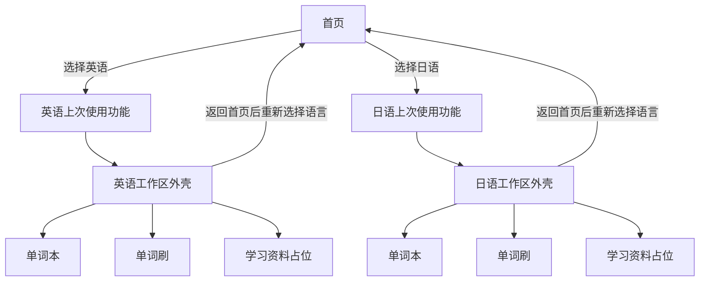

# 语言工作区功能导航重构设计

- 状态：已完成（2026-08-19）
- 日期：2026-08-19
- 适用范围：日语、英语学习空间的入口、功能切换与学习时长展示

## 1. 背景与目标

当前流程需要先从首页进入语言空间，再通过一组功能卡片进入单词本或单词刷。首页与语言空间连续使用卡片入口，信息层级重复，也增加了一次没有实际学习内容的中间跳转。

本次重构移除功能卡片中间页。用户在首页选择语言后，直接进入该语言上次使用的功能；同一语言中的功能通过窗口顶部悬浮选择栏切换。

本阶段目标：

- 减少进入学习功能的步骤，让用户更快进入实际内容。
- 用统一顶部栏替代重复的功能入口卡片。
- 确保顶部栏显示或隐藏时，功能页面的任何控件都不发生位移。
- 保持日语、英语的数据、上次功能和累计学习时长彼此独立。
- 为尚未开发的学习资料提供稳定入口和明确占位状态。

## 2. 范围与非目标

本阶段包含：

- 首页语言卡片直达对应语言的上次使用功能。
- 日语、英语分别记忆上次使用功能。
- 顶部悬浮栏的唤出、隐藏、功能切换和自适应规则。
- 功能选择和当前语言累计时长的统一上层布局，以及各功能页独立的返回入口。
- 单词本、单词刷接入统一工作区外壳。
- 学习资料“功能监修中”占位页。
- 路由、计时、偏好持久化和未完成答题保护规则。

本阶段不包含：

- 顶部栏内切换日语或英语。
- 新增学习资料的导入、列表或阅读能力。
- 保存单词刷未完成会话。
- 新增学习历史、功能使用历史或数据库表。
- 改动单词本和单词刷现有的核心业务规则。

## 3. 已确认的产品决策

1. 顶部栏只能切换当前语言的功能，不提供语言切换。
2. 切换语言必须先返回首页，再选择另一个语言空间。
3. 日语和英语分别保存各自最后一次使用的功能。
4. 某个语言没有历史记录时，首次默认进入单词本。
5. 功能顺序固定为“单词本、单词刷、学习资料”，学习资料始终排在最后。
6. 顶部栏默认隐藏，鼠标靠近窗口顶部时出现，离开后延迟隐藏。**修订（2026-09-16）**：从首页进入语言空间时不再自动显示数秒——它与进入时的启动页光线冲突；进入只播启动页，功能栏一律靠悬停或快捷键唤出。
7. 顶部栏和学习时长为页面上层；学习时长使用“学习时长：xxx小时”的单行文字，贴近功能栏右侧；返回首页保留在各功能页原有的左上箭头中。
8. 同一语言内切换功能时学习计时不中断；返回首页时停止计时。
9. 学习资料占位页仍属于当前语言学习空间，停留期间继续累计该语言时长。

## 4. 新的信息架构



首页语言卡片不再导航到独立的功能选择页。工作区外壳持有两个稳定维度：

- `LanguageSpace`：当前语言，只能由首页选择。
- `WorkspaceFeature`：当前功能，可以由顶部栏切换。

建议新增纯值类型：

```swift
enum WorkspaceFeature: String, CaseIterable, Codable, Hashable {
    case wordBook
    case wordQuiz
    case documents
}
```

`WorkspaceFeature` 只描述功能身份和稳定存储值。标题、顺序、辅助功能文案等展示信息通过扩展集中提供，禁止在多个页面重复维护字符串。

## 5. 路由设计

建议将当前 `.language`、`.wordBook`、`.wordQuiz` 收敛为一个工作区路由：

```swift
enum AppRoute: Hashable {
    case dashboard
    case settings
    case workspace(LanguageSpace, WorkspaceFeature)
}
```

路由规则：

- 首页点击语言卡片时，先读取该语言保存的最后功能，再构造 `.workspace(space, feature)`。
- 顶部栏切换功能时，只更新 `WorkspaceFeature`，不得改变 `LanguageSpace`。
- 返回首页统一切换为 `.dashboard`。
- 设置页仍只能从首页进入，不放入工作区顶部栏。
- 路由的 `learningSpace` 对所有 `.workspace` 功能返回相同的当前语言。

实施过程中先让新旧路由短暂并存，完成页面接入和测试后再删除旧路由及 `LanguageWorkspaceView`。该迁移已完成，应用主流程不再保留旧功能中间页。

## 6. 上次使用功能的持久化

上次使用功能属于轻量界面偏好，不是业务数据，不进入 SwiftData。使用 `UserDefaults` 保存即可。

建议键名：

```text
workspace.lastFeature.japanese
workspace.lastFeature.english
```

保存与恢复规则：

- 日语、英语必须使用不同键，禁止用一个全局值互相覆盖。
- 首次启动、键不存在或存量字符串无法解析时，回退到 `.wordBook`。
- 用户成功进入某功能后再保存，不能在被拦截或取消的切换请求上提前写入。
- 返回首页、切换主题或打开设置不修改最后功能。
- 学习资料虽为占位页，仍是合法的最后功能；下次进入该语言时可直接恢复占位页。
- UI 自动化环境使用可注入的内存偏好，避免测试污染用户真实设置。

偏好访问应包装为独立协议或存储类型，页面不直接散落调用 `UserDefaults.standard`，以便单元测试覆盖缺失值、非法值和双语言隔离。

## 7. 统一工作区外壳

建议由 `WorkspaceShell` 统一负责：

- 当前语言和当前功能。
- 顶部感应区与悬浮栏显隐状态。
- 功能切换请求。
- 当前语言累计学习时长展示。
- 功能页容器与学习资料占位页。
- 离开单词刷时的会话保护协调。

单词本、单词刷和学习资料各自保留一致的左上返回箭头。统一工作区中的箭头直接返回首页；单词刷仍需先经过未完成会话保护。顶部悬浮栏不再重复提供首页按钮。

功能页切换后，数据库数据和应用级设置保持不变。页码、遮挡状态、展开工具栏等纯展示状态允许在页面重新创建后恢复默认；单词刷的已作答会话必须遵循第 11 节的离开保护，不能静默丢弃。

## 8. 顶部悬浮层布局

悬浮层使用覆盖在内容之上的 `overlay` 或顶层 `ZStack`，不得放入功能页面的 `VStack`、`safeAreaInset` 或其他会改变内容可用尺寸的容器。

悬浮层包含两个独立区域：

```text
                    [ 单词本 | 单词刷 | 学习资料 ]  学习时长：2.1小时
```

布局约束：

- 功能选择栏始终以整个窗口的水平中心为基准，不因左右内容宽度不同而偏移。
- 累计学习时长以单行文字显示在功能栏右侧，保留小间距，不使用圆角矩形背景；文字不参与中间功能栏的居中计算。
- 推荐选择栏宽度为 `420...480 pt`，高度约 `58 pt`；最终值集中定义在主题尺寸常量中。
- 顶部悬浮层和窗口上边缘保留适量间距。
- 页面内容在悬浮层出现和隐藏前后使用完全相同的几何尺寸与位置。
- 功能页面保持重构前的原始布局，不得为悬浮栏增加顶部安全间距或整体下移；悬浮栏出现时允许短暂覆盖页面内容。
- 悬浮层的背景在 2026-09-16 修订为**一块贴合功能栏的玻璃板**（`.thickMaterial` + 极淡着色 + 顶缘高光），
  详见《[前端视觉优化实现设计](前端视觉优化实现设计.md)》第 3 节。原规定为"不使用模糊到影响通透度的重材质"，
  与用户后来确认的 Launchpad 质感相反，故改写。细边界与轻阴影保留。
- 悬浮层 `zIndex` 高于所有功能内容、网格和阅读控件，但系统弹窗和确认对话框仍应在其上方。

学习时长沿用现有小时制、一位小数和分段颜色规则，不在顶部栏增加当天学习投入或其他数字。

## 9. 唤出与隐藏交互

窗口顶部中央设置一个透明感应区。感应区宽度必须与居中功能栏一致，不能横跨整个窗口，也不能覆盖左上返回箭头所在的水平区域。建议将感应区尺寸和动画参数集中管理，初始参考值如下：

- 顶部感应宽度：与功能栏相同。
- 顶部感应高度：`18...24 pt`。
- 出现动画：轻微向下移动并淡入，约 `0.20...0.24 s`。
- 离开悬浮层后的隐藏延迟：约 `0.55...0.70 s`。
- 隐藏动画：轻微向上移动并淡出，约 `0.16...0.20 s`。

状态规则：

1. 指针进入顶部感应区时立即取消待执行的隐藏任务并显示悬浮层。
2. 指针从感应区移动到悬浮层本体时保持显示，不能在两者间闪烁。
3. 指针离开感应区和悬浮层后延迟隐藏；延迟期间重新进入则取消隐藏。
4. 确认对话框、菜单或功能切换正在处理时，悬浮层保持显示。
5. 应用失去焦点时取消待执行任务并复位到隐藏状态，避免重新激活后残留半透明栏。
6. 快速反复移入、移出时只允许一个显隐任务生效，旧任务必须取消。

从首页点击英语或日语入口进入工作区时，顶部栏**不再自动显示**（2026-09-16 修订）。原实现会立即显示约 3 秒作为首次使用提示，但它与进入时的启动页冲突——启动页的光线还没散，功能栏已经浮出来，两者互相打架。现在进入语言空间只做一件事：播放启动页（若按频率判定要播）。功能栏一律靠鼠标靠近顶部感应区或快捷键唤出，与工作区内部的显隐规则完全一致。

显隐动画只改变悬浮层自身的 `opacity` 和 `offset`，禁止驱动功能页面的 `padding`、`frame` 或布局条件分支。

## 10. 功能选择与动画

选择栏内部使用三个等宽圆角按钮。当前项由可滑动的圆角背景强调，文字本身不创建额外胶囊边框。

- 点击当前功能不重复创建页面，也不重复写入偏好。
- 切换成功后滑动选中背景，再对功能内容做克制的淡入淡出。
- 选中背景可使用 `matchedGeometryEffect`，但功能内容的外部尺寸必须稳定。
- 页面转场不得使用会推动新旧页面位置的横向滑动，避免破坏单词刷和单词本已经稳定的居中几何。
- 系统开启“减少动态效果”时，选中状态与页面内容直接切换或仅使用短淡入淡出。

顶部栏不显示日语、英语名称切换器。当前语言可通过功能页标题、文案及学习时长的辅助功能标签表达，避免误导用户认为可以直接跨语言切换。

## 11. 单词刷会话保护

单词刷至少提交过一道题后，切换功能或返回首页都可能丢弃内存会话，必须沿用现有离开确认规则。

建议统一流程：

1. `WorkspaceShell` 发出目标功能请求，或功能页左上箭头发出返回首页请求。
2. 当前功能提供 `canLeave` 或等价的离开判定。
3. 无需保护时立即切换。
4. 需要保护时显示确认对话框。
5. 用户取消则保持当前功能、当前会话和原偏好值不变。
6. 用户确认后丢弃会话、完成切换，再保存目标功能偏好。

答题反馈的自动推进任务必须在确认离开后取消，防止已销毁页面仍收到延迟回调。确认对话框显示期间禁止重复发起第二个路由切换。

## 12. 学习资料占位页

学习资料排在顶部栏最后。首版页面仅包含居中的注意符号和文字：

```text
⚠
功能监修中
```

实现时注意符号使用系统图标而非直接写入字符。占位内容在可用内容区域内横向、纵向居中，使用低干扰水印样式，不使用卡片、不展示不可操作的伪按钮，也不暗示已经支持导入。

该页面仍属于当前语言工作区，因此：

- 顶部栏、左上返回箭头和该语言累计时长正常工作。
- 停留期间继续累计当前语言学习时长。
- 可作为该语言的最后使用功能被恢复。

## 13. 计时事务规则

计时归属只由 `LanguageSpace` 决定，不由 `WorkspaceFeature` 决定。

| 导航行为 | 计时结果 |
| --- | --- |
| 首页进入英语任一功能 | 开始或恢复英语计时 |
| 首页进入日语任一功能 | 开始或恢复日语计时 |
| 英语功能之间切换 | 英语计时连续，不暂停、不重复提交 |
| 日语功能之间切换 | 日语计时连续，不暂停、不重复提交 |
| 工作区返回首页 | 提交增量并停止当前语言计时 |
| 停留在学习资料占位页 | 继续累计当前语言时长 |
| 应用失去活跃、休眠或退出 | 沿用现有控制器规则暂停并持久化 |

同一语言内切换功能时，路由变化可以触发同步检查，但不得执行“先离开空间、再重新进入”的两步操作。保存失败时继续沿用现有保守策略：拒绝会造成计时归属分裂的路由变化。

本次不新增数据库表。最后功能使用 `UserDefaults`；长期累计时长和每日学习反馈继续使用现有 SwiftData 模型。

## 14. 键盘、辅助功能与最小窗口

悬浮栏不能只依赖鼠标悬停：

- 通过菜单命令或键盘焦点也可以显示并操作功能选择。
- 建议提供 `Command-1`、`Command-2`、`Command-3` 对应三个功能，实际页面不额外展示快捷键说明文字。
- 三个功能按钮使用明确的 `accessibilityLabel` 和选中状态。
- 学习时长应读作“英语累计学习时长 12.3 小时”或“日语累计学习时长 12.3 小时”。
- 隐藏时的悬浮栏不能继续留在辅助功能和键盘焦点顺序中。
- 焦点位于悬浮栏内部时不得自动隐藏；功能切换后焦点进入新页面的主内容。

在 `820 × 560` 最小窗口下必须保证：

- 中间功能栏仍相对整个窗口居中。
- 右侧时长不改变中间栏的居中位置。
- 左上返回箭头不在感应区内，顶部栏隐藏或显示时均可直接点击。
- 功能内容的核心控件不因顶部栏出现而移动。
- 单词本弹出引导、编辑对话框和单词刷确认对话框位于悬浮层上方。

若后续支持比当前最小宽度更窄的窗口，应优先缩短两侧文案或收敛间距，不将语言切换塞入顶部栏，也不允许中间选择栏偏离窗口中心。

## 15. 测试策略

### 15.1 单元测试

- 两种语言首次均回退到单词本。
- 日语、英语最后功能独立保存和恢复。
- 非法存量值安全回退，不崩溃、不覆盖另一语言。
- 三种工作区功能的 `learningSpace` 均返回正确语言。
- 同语言功能切换不会调用离开计时；返回首页会停止计时。
- 被取消的单词刷离开请求不改变路由和最后功能偏好。

### 15.2 UI 测试

- 首页点击语言后直接进入该语言最后功能，不出现功能卡片中间页。
- 只有窗口顶部中央的感应区可唤出悬浮栏，左上返回区域不能误触发；移入悬浮栏时不闪退，离开后按规则隐藏。
- 顶部栏只有三个功能，不存在首页或语言切换控件。
- 三个功能按固定顺序切换，滑动选中背景和内容状态一致。
- 三个功能页均保留左上返回箭头；学习资料显示居中“功能监修中”，并可正常返回和切换功能。
- 单词刷已有作答时切换功能会确认；取消后题目和答案保持不变。
- 重新进入日语和英语时分别恢复各自上次功能。

### 15.3 几何与视觉验收

- 记录顶部栏隐藏和显示时功能页面关键控件坐标，误差不超过 `1 pt`。
- 默认窗口与 `820 × 560` 下，中间栏中心和窗口水平中心误差不超过 `1 pt`。
- 功能页使用原始顶部内边距，不能因悬浮栏存在而整体下移；允许悬浮栏覆盖顶部内容。
- 悬浮栏显示前后，单词刷答题区、设置区和分隔线尺寸不变。
- 悬浮栏显示前后，单词本标题、正文列和右下阅读按钮位置不变。
- 深浅主题下边界、选中背景、文字和时长颜色均清晰可辨。
- 开启“减少动态效果”后功能完整，不出现残留半透明层或失焦控件。

## 16. 分阶段实施计划

### 步骤一：导航骨架（模型与偏好）

状态：已完成（2026-08-19）

- 新增 `WorkspaceFeature` 和最后功能偏好存储。
- 补充双语言隔离、默认值和非法值单元测试。
- 旧路由与旧语言功能选择页已删除，工作区路由成为唯一运行时功能路由。

### 步骤二：工作区外壳

状态：已完成（2026-08-19）

- 新增统一路由和 `WorkspaceShell`。
- 完成顶部感应区、悬浮层固定几何、功能选择和学习资料占位页。
- 验证显隐不改变内容布局。
- 根据实机反馈将感应区收窄到居中功能栏宽度，并从悬浮栏移除首页按钮。
- 旧语言功能卡片页和旧分散路由已在步骤五移除；功能页内部页眉仍由各功能自行负责。
- `820 × 560` 实机 UI 测试已验证：选择栏相对窗口居中、左右控件不重叠、显隐前后内容坐标不变、延迟隐藏正常。
- 已验证单词刷作答后通过悬浮栏离开会触发确认，取消后保留当前题目。
- 键盘功能切换由 `Command-1/2/3` 统一接管，并通过工作区离开协调器处理。

### 步骤三：接入单词本

状态：已完成（2026-08-19）

- 将单词本内容嵌入工作区外壳。
- 保留单词本原有左上返回箭头，在统一工作区中直接返回首页。
- 恢复单词本原有顶部布局，不为悬浮栏增加安全间距；悬浮栏允许覆盖页面顶部内容。
- 验证导入、导出、编辑、阅读遮挡和分页功能无回归。
- 统一工作区中的功能页箭头直接返回首页；不再存在旧独立单词本路由。
- 顶部栏显隐只改变覆盖层自身，标题、引导、工具栏和阅读控件的坐标保持稳定。
- 单元测试全量通过；`820 × 560` 下 5 项单词本 UI 回归通过，覆盖新增与修改、引导、阅读遮挡、20/21 条分页边界、换页复位和悬浮栏几何。

### 步骤四：接入单词刷

状态：已完成（2026-08-19）

- 将单词刷内容嵌入工作区外壳，顶部栏切换到单词刷时不改变答题主体几何。
- 接入工作区级离开拦截：至少提交一道题后，顶部栏切换和页面左上返回都会先显示放弃确认。
- 确认离开后取消自动推进任务、清理内存会话并执行目标导航；取消离开则保留当前题目和反馈。
- 保留单词刷内部左上返回箭头并接入首页导航；空闲态直接返回，答题态遵循离开保护。
- 自动推进、正确选项环形反馈、音效、设置锁定和结算/错题再战继续由单词刷页面状态统一管理。
- 统一工作区路径下补充最小窗口 UI 验收；不再存在旧独立单词刷路由。

### 步骤五：收敛旧架构

状态：已完成（2026-08-19）

- 首页已读取双语言独立的最后功能偏好，并直接进入统一工作区。
- 主流程已移除旧功能卡片中间页和旧分散路由，工作区路由成为唯一运行时路由。
- `Command-1/2/3` 已迁移为工作区内的单词本、单词刷和学习资料命令；命令请求交由当前工作区离开协调器处理，单词刷未完成时不会绕过确认。
- 工作区命令仅在当前路由属于统一工作区时启用；首页仍通过语言卡片切换语言，顶部栏和命令菜单不提供跨语言切换。
- 补充首页直达、最后功能恢复和快捷键导航的回归测试，并完成单元测试与核心 UI 测试。
- 最终回归已完成：单元测试 87/87、macOS UI 测试 22/22 全部通过。

只有当前步骤验收通过后才进入下一步，避免同时修改路由、布局和功能业务导致问题难以定位。

## 17. 完成标准

- 首页选择语言后一步进入该语言上次功能，首次默认单词本。
- 日语、英语最后功能独立，重启应用后仍能正确恢复。
- 顶部栏只能切换功能，不能切换语言。
- 顶部栏默认隐藏且可可靠唤出，出现和隐藏不会改变功能页面几何。
- 返回首页位于各功能页左上角；功能选择和累计时长处于悬浮层，选择栏严格相对窗口居中。
- 单词本、单词刷和学习资料占位页均在统一外壳内工作。
- 同一语言内切换功能时计时连续，返回首页时正确停止。
- 单词刷未完成会话不会被静默丢弃。
- 深浅主题、最小窗口、键盘和减少动态效果下均可正常使用。
