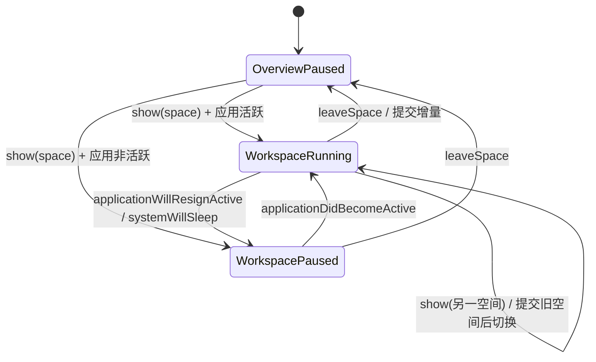

# 长期学习计时实现设计

- 状态：实现完成，待 UI 验收
- 日期：2026-08-17
- 关联决策：[ADR-001：本地优先与长期累计计时](../architecture/架构决策-001-本地优先学习计时.md)

## 1. 目标与边界

本阶段把产品需求中的长期学习时长落地为可持久化、可恢复、不可手工修改的应用级能力。计时语义参考 Steam 对不同游戏分别累计游玩时长的方式：日语和英语拥有独立累计值，但同一时刻只有当前正在使用的语言空间可以计时。

本阶段包含：

- 每个语言空间一条本地累计时长记录。
- 进入、切换、离开语言空间时的状态转换。
- 应用失去焦点、重新激活、系统休眠、窗口关闭和应用退出时的暂停与恢复。
- 活跃期间的周期性检查点保存。
- 语言空间内按小时显示一位小数及对应颜色。
- 控制器、仓储和生命周期事件的单元测试与关键 UI 验收。

本阶段不包含：

- 学习会话历史、每日时长、打卡、计划或提醒。
- 手工增加、减少、修正或清空累计时长。
- 根据应用关闭期间的墙上时钟时间补算时长。
- 云端同步、多窗口计时或动态添加语言。

## 2. 核心不变量

以下规则必须由领域层保证，不能只依赖视图约定：

1. 日语和英语的累计值完全独立，任何查询或写入都必须携带明确的语言空间 ID。
2. 全局最多只有一个正在运行的语言计时区间。
3. 计时只能通过控制器的状态转换增加，控制器不公开任意设置累计秒数的接口。
4. 当前展示空间和当前正在计时的空间分开建模。应用失去焦点时，展示空间仍然保留，但运行中的空间为空。
5. 累计值始终为有限、非负的精确秒数；显示层的小时和颜色不能写回数据库。
6. 持久化成功前不能推进计时起点。保存失败时必须保留完整的未提交增量，下一次保存继续尝试。
7. 重复或乱序的生命周期事件必须幂等，不得重复提交同一段时间。
8. 暂停边界保存失败时，必须保留该区间的固定结束时刻；重试不能把应用失焦或系统休眠期间算入学习时长。

## 3. 持久化模型

### 3.1 SwiftData 模型

新增 `StudyTimeRecord` 模型，每个内置语言空间恰好一条记录：

```text
StudyTimeRecord
  id: UUID
  languageRawValue: String   // japanese 或 english，唯一
  totalSeconds: Double       // 精确累计秒数
  updatedAt: Date            // 最近一次成功保存时间
```

`languageRawValue` 使用稳定的 `LanguageSpace.rawValue`，不把日语和英语拆成两个字段。模型的唯一约束防止启动初始化或并发保存时产生重复语言记录。`totalSeconds` 不按小时取整，不保存显示颜色，也不保存最近一次进入时间。

应用启动时由仓储读取两个语言的记录；缺少记录时创建值为 `0` 的记录并保存。若记录不是有限数或小于零，仓储拒绝继续写入并返回存储错误，不能静默重置用户已有时长。

### 3.2 仓储接口

视图和计时控制器不直接操作 `ModelContext`。仓储只提供计时所需的最小能力：

```text
loadAll() -> [LanguageSpace: StudyTimeSnapshot]
saveTotalSeconds(space, totalSeconds, updatedAt) throws
```

仓储负责：

- 在独立的 `ModelContext` 中查询或更新记录。
- 校验语言 ID、秒数范围和有限性。
- 使用一次 `save()` 提交单次检查点。
- 保存失败时保留上一次有效数据库值，并将错误交给控制器。
- 通过内存容器提供测试替身，不在生产环境静默降级为内存计时。

控制器传入的语言空间来自状态转换，而不是页面当前可变状态，因此文件选择、导航或视图重建不会改变一次保存的归属。

## 4. 运行时计时控制器

### 4.1 所有权

应用只创建一个 `StudyTimeController`，由 `AppDependencies` 组装并注入应用根节点。控制器使用 `@MainActor` 隔离 UI 状态和 SwiftData 仓储，采用 `@Observable` 让语言空间页面只订阅需要显示的值。

控制器内部维护：

```text
visibleSpace: LanguageSpace?       // 当前主窗口展示的语言空间
activeSpace: LanguageSpace?        // 当前正在计时的语言空间
startInstant: SuspendingClock.Instant?
pendingCommit: PendingCommit?      // 暂停边界保存失败时的固定区间
isApplicationActive: Bool
isSystemSuspended: Bool
totalSecondsBySpace: [LanguageSpace: Double]
hasUnsavedChanges: Bool
lastSaveError: Error?
```

`visibleSpace` 为 `nil` 表示总览页；`activeSpace` 为 `nil` 表示当前没有计时。两者不能合并成一个可空字段。

`PendingCommit` 至少包含语言空间、区间起点和区间终点。它只表示已经停止计时但尚未成功写入的固定区间，不表示新的活动计时。活动计时和待提交区间不能同时属于不同语言。

控制器向外只暴露意图方法：

```text
show(space)
leaveSpace()
applicationDidBecomeActive()
applicationWillResignActive()
systemWillSleep()
systemDidWake()
applicationWillTerminate()
checkpoint()
```

`show(space)`、`leaveSpace()` 和生命周期方法需要返回成功或可展示的存储错误。切换到另一语言时，只有旧空间提交成功后才能确认新路由；如果返回总览时保存失败，则可以先停止计时并进入总览，同时保留 `pendingCommit` 和未保存提示。不提供 `setTotalSeconds`、`addHours`、`reset` 等公开方法。内部可以提供只读的 `displayedHours(for:)` 和 `displayColor(for:)`，供页面渲染。

### 4.2 时间来源与采样

计时使用 `SuspendingClock`，而不是 `Date` 或 `Timer` 的墙上时间：

- 用户修改系统日期不会造成负时长或跳跃。
- 系统休眠期间时钟暂停，不会把电脑休眠时间误算为学习时间。
- 每次状态转换只读取一次当前时刻，并使用该采样值计算增量。

伪代码如下：

```text
commitActiveSpace(at now, pausing):
  如果 activeSpace 或 startInstant 为空，直接返回成功
  delta = max(0, now - startInstant)
  如果 delta == 0，直接返回成功
  targetTotal = totalSecondsBySpace[activeSpace] + delta
  尝试保存 targetTotal
  保存成功：更新内存累计值，并将 startInstant = now
  保存失败且 pausing：记录 [startInstant, now] 为 pendingCommit，清空 activeSpace 和 startInstant
  保存失败且仍运行：保留原累计值和 startInstant，标记 hasUnsavedChanges
```

只有保存成功才推进 `startInstant`。暂停边界失败时虽然会清空活动状态，但会把原起点和本次暂停采样时刻保存到 `pendingCommit`；重试只提交该固定区间，不会采样更晚的时刻。这样即使本地数据库暂时不可用，未保存的时间也不会被覆盖、重复计算或错误包含后台时间。

### 4.3 状态转换

状态可以概括为“总览暂停”“语言空间展示但暂停”“语言空间展示且计时”三种稳定状态：



具体规则：

#### 进入或切换空间

1. 先提交旧空间的必要增量，再更新 `visibleSpace`；路由更新必须和这次转换一起成功。
2. 应用非活跃或系统休眠时，只更新展示空间，不启动计时。
3. 目标已经是 `activeSpace` 时保持原起点，不重复计时。
4. 目标不同且存在旧的 `activeSpace` 时，先提交旧空间增量。
5. 旧空间提交成功后，设置目标为唯一 `activeSpace`，记录新的 `startInstant`。
6. 如果旧空间提交失败，整个切换事务失败：保留旧的 `visibleSpace` 和活动状态，并提示未保存；这样不会在两个空间之间同时产生未确认的计时区间。待页面确认成功后再更新路由。

#### 返回总览

1. 提交当前活动空间到当前采样时刻。
2. 保存成功后清空 `activeSpace` 和 `startInstant`。
3. 清空 `visibleSpace`，总览页不计时。

#### 应用失去焦点或系统休眠

1. 先提交当前活动空间。
2. 无论是否有实际增量，都清空 `activeSpace` 和 `startInstant`，避免后台继续累计；保存失败时先创建固定边界的 `pendingCommit`。
3. 保留 `visibleSpace`，用于重新激活后恢复正确语言。
4. 重复通知不执行第二次提交，也不创建第二个待提交区间。

#### 应用重新激活与系统唤醒

1. 应用重新激活时更新应用活跃状态；系统唤醒时只清除休眠标记，不改变应用活跃状态。
2. `visibleSpace` 为空时保持暂停。
3. 如果存在 `pendingCommit`，先按固定结束时刻重试保存；失败时保持暂停，不启动新计时。
4. 只有应用活跃且不处于系统休眠状态时，`visibleSpace` 非空且没有 `activeSpace` 才能以当前时刻创建新的 `startInstant`。
5. 已经在计时或仍处于休眠状态时不创建第二个起点；单独的系统唤醒通知不能绕过应用非活跃状态。

#### 关闭与重启

窗口关闭或应用退出前立即提交一次并停止计时。若进程异常退出，只能保证丢失最近一次成功检查点之后的增量；重启后不根据上次启动时间或退出时间补算关闭期间的时长。

## 5. 检查点与错误处理

### 5.1 检查点策略

- 活跃计时期间每 30 秒触发一次 `checkpoint()`。
- 检查点使用同一个 `now` 采样值计算和保存，不能先计算后再次读取时钟。
- 空增量不触发数据库写入。
- 正常空间切换、返回总览、失去焦点、休眠、窗口关闭和应用退出都立即检查点。
- 检查点只更新累计值，不创建学习会话记录。
- 控制器每秒刷新一次页面显示，但只有达到检查点或生命周期边界时才写入数据库。

检查点任务属于控制器，不属于 `LanguageWorkspaceView`。页面销毁、动画过渡或单词本导航不会导致任务重复启动。控制器销毁时取消任务，并在应用退出事件中先执行同步提交。

### 5.2 持久化失败

保存失败时：

1. 不更新对应的内存累计值。
2. 不推进 `startInstant`。
3. 若仍处于活动计时，保留 `activeSpace`，使下一次检查点可以提交完整未保存增量。
4. 若这是暂停、离开或切换前的提交，记录固定的 `pendingCommit`，停止活动计时；重试时只使用该区间的结束时刻。
5. 设置 `hasUnsavedChanges = true` 并暴露可理解的错误提示。
6. 不自动切换到另一个语言空间，避免在旧空间未确认保存时产生两个待提交区间。

下一次保存成功后清除对应的待提交区间和错误状态。连续失败时无法保证固定的异常退出丢失上限，界面需要持续显示未保存提示，而不能伪装成已安全保存。若应用在待提交区间尚未保存时异常退出，该固定区间仍可能丢失，这是本地进程无法继续执行保存的边界。

## 6. 页面与应用接入

### 6.1 路由接入

`ContentView` 仍然是路由事实来源，但不直接计算时间。路由变化只调用控制器的意图：

- `.dashboard`：`leaveSpace()`；即使暂停边界保存失败，也可以进入总览，但必须保留未保存提示和待提交区间。
- `.workspace(space, feature)`：`show(space)`；单词本、单词刷和学习资料占位页都属于该语言空间，不创建第二个计时器。

应避免在多个页面同时使用 `onAppear` 启动计时。推荐由根路由变化统一发送意图，页面只读取控制器公开的只读状态。

### 6.2 应用生命周期接入

由应用级生命周期桥接统一转发：

- `NSApplication.didBecomeActiveNotification` -> `applicationDidBecomeActive()`。
- `NSApplication.willResignActiveNotification` -> `applicationWillResignActive()`。
- `NSWorkspace.willSleepNotification` -> `systemWillSleep()`。
- `NSWorkspace.didWakeNotification` -> `systemDidWake()`。
- 主窗口关闭和应用终止回调 -> `applicationWillTerminate()`。

通知监听器由应用依赖或 `AppDelegate` 创建，并在释放时移除。所有回调切回 `MainActor` 后再调用控制器，避免并发修改路由和累计值。

### 6.3 学习空间显示

学习空间只显示当前 `space` 对应的快照：

```text
hours = roundToOneDecimal(totalSeconds / 3600)
text = "{hours} 小时"
color = colorForDisplayedHours(hours)
```

页面不提供编辑、加时、清零、暂停或保存按钮。应用切换语言空间时，页面随路由刷新，控制器仍是唯一事实来源。

## 7. 小时格式与颜色规则

内部秒数先换算为小时，再四舍五入到一位小数；显示值不写回数据库。颜色按最终显示值判断，避免出现“显示 50.0 小时但已经是蓝色”的不一致：

| 最终显示小时 | 文字颜色 |
| --- | --- |
| `0.0` 或 `0.0 < h <= 50.0` | 主题默认文字色（浅色黑色，深色白色） |
| `50.0 < h <= 100.0` | 蓝色 |
| `100.0 < h <= 300.0` | 紫色 |
| `h > 300.0` | 橙色 |

颜色是纯派生值，不保存到 `StudyTimeRecord`。显示格式必须使用稳定的小数点和单色数字字体，避免窗口宽度变化导致数字跳动。阈值测试至少覆盖 `0.0`、`50.0`、`50.1`、`100.0`、`100.1`、`300.0` 和 `300.1`。

## 8. 测试设计

### 8.1 单元测试

使用可控的时钟和内存仓储，禁止测试依赖真实等待：

- 初始加载缺少记录时创建两个零值记录。
- 进入日语后只增加日语，英语保持不变。
- 日语切换英语时先提交日语，再从新的起点累计英语。
- 重复进入当前空间不创建第二个起点。
- 返回总览、失去焦点、休眠时提交一次并暂停。
- 失去焦点后重复收到通知不会重复累计；重新激活按当前展示空间恢复。
- 总览状态重新激活不启动计时。
- 应用重启读取已保存值，关闭期间不补算。
- 检查点保存失败时累计值和起点保持不变，下一次成功保存提交完整增量。
- 暂停或切换时保存失败不会把失焦、休眠或重试等待期间计入学习时长。
- 旧空间保存失败时切换事务失败，路由和计时归属保持一致。
- 时钟差为零或异常负值时不产生负时长。
- 语言记录互相隔离，公开 API 不存在任意修改累计值的入口。
- 小数小时格式和全部颜色边界符合第 7 节规则。

### 8.2 SwiftData 持久化测试

- 使用临时磁盘容器保存日语和英语记录。
- 销毁并重新创建仓储后，累计秒数保持一致。
- 模拟保存错误时，数据库中仍保留上一次成功值。
- 重复初始化不会创建重复语言记录。
- 非法的负数或非有限秒数不会被静默覆盖。

### 8.3 UI 测试

- 总览 -> 日语空间后显示日语独立时长标识。
- 日语 -> 英语后页面归属和时长标识同步切换。
- 进入单词本后仍属于原语言空间，不出现第二个计时入口。
- 返回总览后计时停止，重新进入后继续使用已持久化累计值。
- 浅色和深色主题下默认、蓝色、紫色、橙色文字均清晰可辨。
- `820 × 560` 最小窗口下时长文本不裁切、不溢出，VoiceOver 能读出语言和累计小时。

## 9. 分阶段实施顺序

1. **模型与仓储**：新增 `StudyTimeRecord`，接入正式 SwiftData Schema，完成读取、保存和错误测试。
2. **纯控制器**：实现可注入时钟的状态转换，不接 UI，完成所有生命周期和失败路径测试。
3. **应用接入**：由 `AppDependencies` 创建单一控制器，接入根路由、AppDelegate 和系统休眠通知。
4. **页面显示**：替换学习空间中的硬编码 `0.0 小时`，接入一位小数格式和颜色派生逻辑。
5. **质量验收**：执行 Debug 构建、计时相关单元测试、核心 UI 测试，并检查最小窗口和两套主题。

每一步完成后先审查变更范围和测试结果，再进入下一步；任何新增需求（会话历史、手工调整、多窗口）都必须另开设计文档，不在本阶段顺带实现。

## 10. 验收标准

- 日语和英语各自拥有一条持久化累计记录，互不污染。
- 进入某空间开始计时，切换空间时旧空间停止、新空间开始，任意时刻最多一个活动计时。
- 使用资料、单词本等空间功能时保持该空间计时。
- 返回总览、应用后台、系统休眠、窗口关闭和应用退出时停止计时。
- 应用重新激活且仍展示语言空间时恢复；重新启动不补算关闭期间时长。
- 时长内部保存精确秒数，界面只显示一位小数，不允许手工更改。
- 检查点或生命周期保存失败不会静默丢弃未保存增量，并能向用户反馈。
- 达到颜色边界时显示值和颜色一致，浅色、深色主题均满足可读性。
- 计时控制器、SwiftData 仓储、生命周期接入和核心 UI 路径均有对应测试。

## 11. 实施记录

- 2026-08-17：完成 `StudyTimeRecord`、SwiftData 仓储、应用级计时控制器、路由和应用生命周期接入。
- 2026-08-17：完成独立语言累计、暂停边界重试、每秒显示刷新、颜色派生和存储错误提示。
- 2026-08-17：计时相关单元测试与 SwiftData 持久化重开测试通过；UI runner 在当前环境启动阶段异常退出，待在 Xcode 本机 UI 测试环境中验收。
